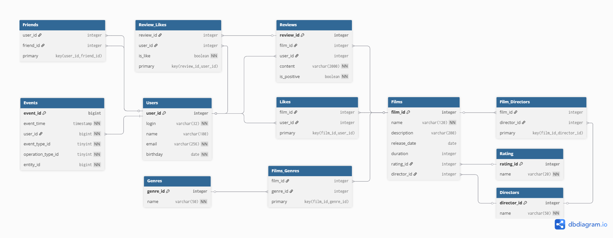

# Фильморейт

## Схема базы данных


* [Ссылка](https://app.quickdatabasediagrams.com/#/d/i89NpA) на .
* [Скрипт](ER-diagram/QuickDBD-12_sprint.sql) базы данных в SQL на основе H2.

## Примеры запросов к контроллерам с выгрузкой данных
<sup>С учетом пройденого материала</sup>

### Film
* вывод всех фильмов
  ```SQL
  SELECT f.film_id,
         f.name,
         f.description,
         f.release_date,
         f.duration,
         r.name AS rating
  FROM Films f
  LEFT JOIN Rating AS r ON f.rating_id = r.rating_id
  ```

* вывод конкретного фильма `id`
  ```SQL
  SELECT f.film_id,
         f.name,
         f.description,
         f.release_date,
         f.duration,
         r.name AS rating
  FROM Films f
  LEFT JOIN Rating AS r ON f.rating_id = r.rating_id
  WHERE f.film_id = /*id*/;
  ```
* получение фильмов с их жанром (в одну строку)
  ```SQL
  SELECT f.film_id,
         f.name,
         f.description,
         f.release_date,
         f.duration,
         r.name AS rating,
         string_agg(g.name, ', ') AS genres
  FROM Films f
  LEFT JOIN Films_Genres AS fg ON f.film_id = fg.film_id
  LEFT JOIN Genres AS g ON fg.genre_id = g.genre_id
  LEFT JOIN Rating AS r ON f.rating_id = r.rating_id
  GROUP BY f.film_id,
           f.name;
  ```

* получение `count` популярных фильмов (без учета не оцененных фильмов)
  ```SQL
  SELECT f.film_id,
         f.name,
         f.description,
         f.release_date,
         f.duration,
         r.name AS rating,
         COUNT(l.user_id) AS likes_count
  FROM Films f
  LEFT JOIN Rating AS r ON f.rating_id = r.rating_id
  LEFT JOIN Likes AS l ON f.film_id = l.film_id
  GROUP BY f.film_id, f.name, f.description, f.release_date, f.duration, r.name
  HAVING COUNT(l.user_id) > 0
  ORDER BY likes_count DESC
  LIMIT /*count*/;
  ```

### User
* вывод всех пользователей
  ```SQL
  SELECT u.user_id,
         u.login,
         u.name,
         u.email,
         u.birthday
  FROM Users u;
  ```

* поиск подтвержденных друзей `id`
  ```SQL
  SELECT u.user_id,
         u.login,
         u.name,
         u.email,
         u.birthday
  FROM Friends f
  LEFT JOIN Users AS u ON f.friend_id = u.user_id
  WHERE f.user_id = /*id*/
  AND f.confirmed = true;
  ```

* поиск общих друзей `id` `friendId`
  ```SQL
  SELECT u.user_id,
         u.login,
         u.name,
         u.email,
         u.birthday
  FROM Friends f1
  INNER JOIN Friends f2 ON f1.friend_id = f2.friend_id
  INNER JOIN Users u ON f1.friend_id = u.user_id
  WHERE f1.user_id = /*id*/
  AND f2.user_id = /*friendId*/
  AND f1.confirmed = true
  AND f2.confirmed = true;
  ```

* проверка подтверждения дружбы `id` `friendId`
  ```SQL
  SELECT f.confirmed
  FROM Friends f
  WHERE f.user_id = /*id*/
  AND f.friend_id = /*friendId*/
  AND f.confirmed = true;
  ```