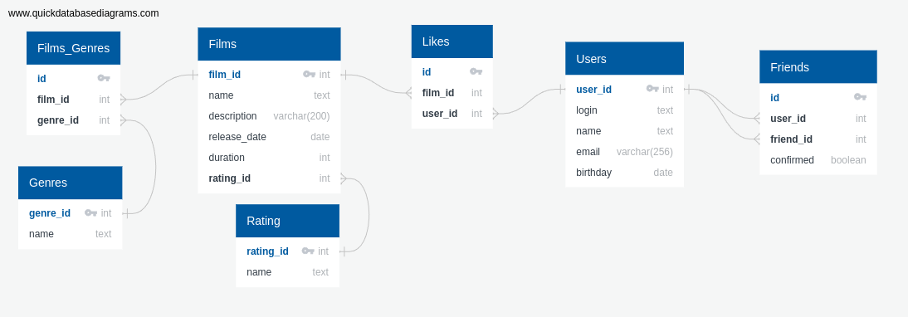

# java-filmorate (12 Sprint)

## Диограммв для p2p проверки


* [Ссылка](https://app.quickdatabasediagrams.com/#/d/i89NpA) на диограмму.
* [Скрипт](src/ER-diagram/QuickDBD-12_sprint.sql) базы данных в SQL формате.

## Примеры запросов к контроллерам с выгрузкой данных
### Film
  * `findAll()` - вывод всех фильмов
    ```SQL
    SELECT f.film_id,
           f.`name`,
           f.description,
           f.releaseDate,
           f.duration,
           r.`name` AS rating
    FROM Films f
    LEFT JOIN Rating AS r ON f.rating_id = r.rating_id
    ```
  
  * `findFilm(id)` - вывод конкретного фильма
    ```SQL
    SELECT f.film_id,
           f.`name`,
           f.description,
           f.releaseDate,
           f.duration,
           r.`name` AS rating
    FROM Films f
    LEFT JOIN Rating AS r ON f.rating_id = r.rating_id
    WHERE f.film_id = /*id*/
    ```
  * получение фильмов с их жанром
    ```SQL
    SELECT f.film_id,
           f.`name`,
           g.`name` AS genre
    FROM Films f
    LEFT JOIN Film_Genre AS fg ON f.film_id = fg.film_id
    LEFT JOIN Genre AS g ON fg.genre_id = g.genre_id
    GROUP BY f.film_id,
             f.`name`,
             g.`name`
    ```
    
  * `getPopularFilms(count)`
